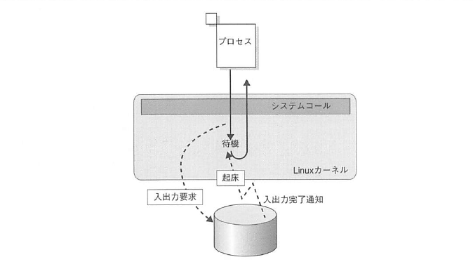
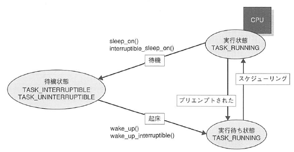
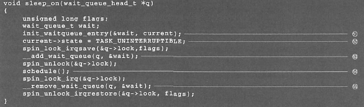
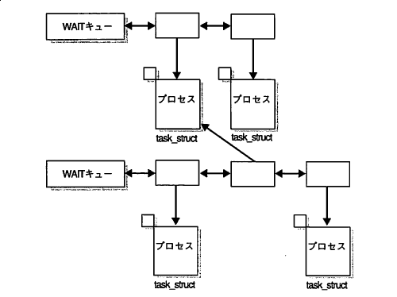
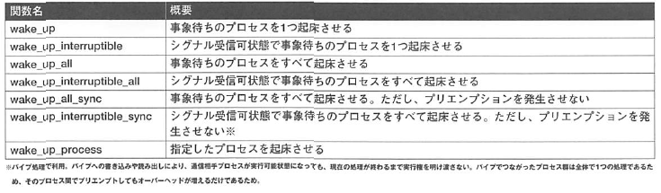

# 輪講 Linuxカーネル2.6解読室 1.7-1.8
sksat

---

# 1.7 事象の待ち合わせ

- 実行可能状態(state = TASK_RUNNING)
	- スケジューリング対象
- 待機状態(state = TASK_INTERRUPTIBLE, TASK_UNINTERRUPTIBLE)
	- 何らかの事象(readなど)を待ち合わせている

---

## 1.7.1 待機処理
- 待機の対象となるカーネルオブジェクトはWAITキューをもつ
	- ファイル，実ページ，端末など
	- WAITキューにはwait_queue_t型を介してプロセスを登録する

---

### sleep_on関数
- プロセスを待機状態にする関数

wait_queue_tをスタックに確保 -> stateを変更
  -> (ロックを取って)WAITキューに登録 -> スケジューラを呼ぶ
  -> 起床 -> WAITキューからプロセスを外す

---

- wait_queue_t(task_structを参照している)をWAITキューに登録する
	- 複数のWAITキューにプロセスを登録できる
	- いずれかの事象が成立したら起床
	- select,pollシステムコールの実現に利用

---

### 待機状態への遷移処理(通常)

- 事象が成立しているか調べる

* **ここで事象が起きてしまう可能性があると起床できなくなる**

- 成立していなければsleep_onを呼び出す
	- WAITキューに登録
	- スケジューラを呼び出す
	- 起床したらWAITキューから外す

* プロセスを待機状態にさせるとき，WAITキュー操作やスケジューラ呼び出しを直接行う箇所がある(sleep_on,sleep_on_interruptibleと同等)

---

### 待機状態への遷移処理(sleep_onを使わない場合)
- プロセスをWAITキューに登録
- 事象が成立しているか調べる
- 成立していなければ，スケジューラを呼び出す
- プロセスが起床したらWAITキューから外す

* 成立条件が単純なときはwait_event/wait_event_interruptibleマクロで記述可能

* prepare_to_wait()

---

## 1.7.2 起床処理

- 待機状態プロセスを起床させる関数群

---

### try_to_wake_up
- wake_up関数内で呼び出される．プロセス1つを起床させる．

プロセスが属するRUNキューをロック -> activate_task
  -> カレントプロセスより優先度が高い場合，再スケジューリング要求(resched_task)
  -> プロセスを実行可能状態にする(state = TASK_RUNNING)

### activate_task

実行優先度を計算 -> RUNキューにつなぐ(__activate_task)

---

## 1.7.3 そのほかの待機/起床処理関数
- 待機/起床を行う関数の1種にcompletionという仕組みも用意されている
- 事象の発生回数と起床回数をそろえる

|関数||
|-|-|
|wait_for_completion|条件の完了を待ち合わせる|
|complete|条件を1つ完了|
|complete_all|ある条件の完了を待ち合わせているプロセスをすべて起床させる|

---

## 子プロセスのスケジューリング
- forkで生成された子プロセスはスケジューリング対象になる(wake_up_forked_process, 第7章)
- 実行優先度は親から引き継ぐ
- 子プロセスは親より先に動作
	- ほとんどの子プロセスはすぐexecする
	- copy on writeの発生を抑制するため
- 親は実行割り当て時間の半分を子プロセスに譲る
	- 特定のプロセスが大量にforkしても他のプロセスへ与える影響を最小限にする

---

# 1.8 最後に

---

# 参考になりそうな資料

[Evolution of the x86 context switch in Linux](https://www.maizure.org/projects/evolution_x86_context_switch_linux/)
[linuxカーネル4.1のプロセススケジューラ(ドラフト)](https://qiita.com/satoru_takeuchi/items/80ee8cef98a73b4af67d)
