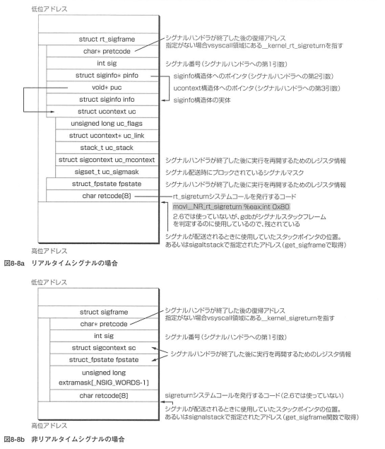

# 輪講 Linuxカーネル2.6解読室 8章 シグナル処理
sksat

---

# 8.1 シグナル機構の実装

### シグナルとは？
* カーネル/プロセスから事象をプロセスに通知する仕組み
* 同期事象と非同期事象を通知できる
* 同期シグナル: メモリ保護例外(SIGSEGV), 不正な命令(SIGILL)
* 非同期シグナル: インターバルタイマ(SIGALRM), 非同期I/O完了通知, Ctrl+C(SIGINT), Ctrl+Z(SIGSTP)

---

### シグナル処理の流れ

* プロセスが指定したシグナルハンドラが実行される
* ハンドラの実行中はそれまでの実行は中断される
* ハンドラの処理終了後，中断されていたところから実行再開
* ハンドラが指定されていない場合はデフォルトの処理が行われる

---

## 8.1.1 シグナルの配送先とスレッド

* 同期シグナル   -> その事象を起こしたスレッドに配送
* 非同期シグナル -> スレッドグループに配送

---

## 8.1.2 シグナルのマスク

* シグナルが配送されてはまずいときには「マスク」できる
* マスクされている間は保留
* マスクが解除されたときに配送
* 保留中に同じシグナルが複数生成されても配送されるのは1度

---

## 8.1.3 スレッドとシグナルハンドラ/マスク

* シグナルハンドラ: スレッドグループに対して設定
* シグナルマスク  : スレッドごとに設定
* 全てのスレッドでマスクされている場合にシグナルが保留される
* マルチスレッドアプリケーションではシグナル処理専用のスレッドが用意される

---

## 8.1.4 シグナルの種類

* SIGKILLとSIGSTOPだけはハンドラを変更できない

---

## 8.1.5 リアルタイムシグナル(queued realtime signal)

- POSIXで新たに規定された仕様

---

# 8.2 シグナル処理のカーネルコード

## 8.2.1 データ構造

---

## 8.2.2 シグナルハンドラとマスクの設定

## 8.2.3 シグナルの配送

### 8.2.3.1 シグナルハンドラの設定

- do_sigaction関数でsighand構造体にハンドラを設定する

---

### 8.2.3.2 シグナルの生成

|カーネルのシグナル処理関数||
|-|-|
|specific_send_sig_info|指定されたプロセスに対してシグナルを送信|
|group_send_sig_info|指定されプロセスグループに対してシグナルを送信|

* 実際の処理は[send_signal関数](https://elixir.bootlin.com/linux/v2.6.11-tree/source/kernel/signal.c#L775)が行う

---

#### send_signal関数の処理

* sigqueue構造体を確保しリストにつなぐ
* infoがSEND_SIG_NOINFO(0)またはSEND_SIG_PRIV(1)のときはinfoを初期化, それ以外はcopy_siginfo関数でコピー
* signal番号に対応したビットを立てる: sigaddset(&signals->signal, sig)
* send_sig_info関数の呼び出し元でsignal_wake_up関数を呼ぶ

- リアルタイムシグナルはsigqueueを確保する必要がある
  - メモリ不足時にシグナルを生成できるとは限らない
- 非リアルタイムシグナルではsigaddsetだけで済む
  - 必ずシグナルを生成できる
  - SIGKILLやSIGSTOPを送信できることを保証

---

### 8.2.3.3 シグナルのマスク・アンマスク

- task_structのblockedメンバーのビットのセット・クリアで行う
- マスクを変更して新たに配送が可能になったシグナルがあるときはTIF_SIGPENDINGフラグを立てる

---

### 8.2.3.4 シグナルの配送

- 非リアルタイム/リアルタイムシグナルでシグナルハンドラの引数が違う
  * 別の関数で別のスタックフレームを作成する(setup_rt_frame,setup_frame)
  * このスタックに実行時の情報とシグナルハンドラの引数を積む

---

#### シグナルの配送手順

---

#### シグナルハンドラ呼び出しのスタックフレーム

---

### 8.2.3.5 シグナルハンドラからの復帰(sigreturn関数,rt_sigreturn関数とvsyscall)

---

## 8.2.4 シグナルとジョブコントロール

- シグナルはジョブコントロールにも使用される

### 8.2.4.1 スレッドグループの停止

* [do_signal_stop関数](https://elixir.bootlin.com/linux/v2.6.11-tree/source/kernel/signal.c#L1673)でプロセスの実行状態をTSK_STOPに変更
* [finish_stop関数](https://elixir.bootlin.com/linux/v2.6.11-tree/source/kernel/signal.c#L1638)でCPUを手放す

### 8.2.4.2 スレッドグループの実行継続
- 停止させられているプロセスはSIGCONTで実行継続

--- 

# 8.3 おわりに
