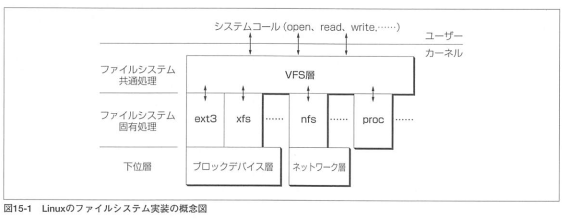
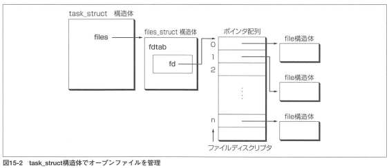
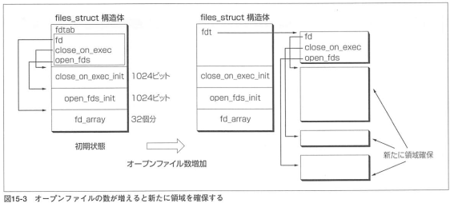
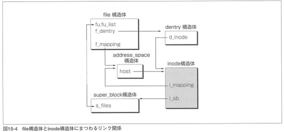
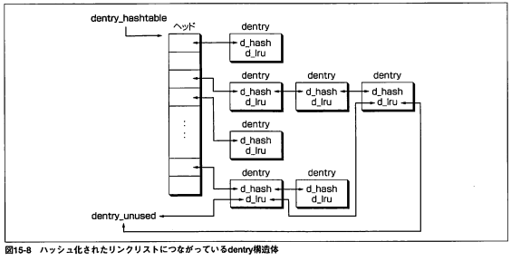
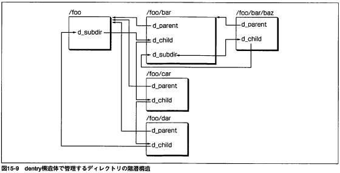

# 輪講 Linuxカーネル2.6解読室 15.1-15.4
sksat

---

# 15.1 VFS層とは

- VFS: Virtual Filesystem
- ファイルシステムに共通の処理を行う
- ファイルシステムによって異なる部分を隠蔽する
- "ファイル"を抽象化して扱う

---

# 15.2 VFS層のデータ構造

---

## 15.2.1 inode構造体

- ファイルを管理するiノード
- iノードとファイルは一意に対応
- 各fsに共通の管理情報を扱う
	- iノード番号, ファイルの大きさ, アクセス時刻, ...

---

## 15.2.2 address_space構造体

- ファイルと仮想記憶管理の間のやりとりを制御
- ページキャッシュ
- 対応するinode, ページキャッシュリスト, ページキャッシュ総数...

---

## 15.2.3 dentry構造体

- ディレクトリエントリをモデル化したもの
	- ディレクトリエントリの所有者
	- ファイル名
	- ファイルに対応するiノード

## 15.2.4 file構造体

- オープンしたファイルを管理
- dentry, フラグ, オープンモード, ファイルオフセット...

---

## 15.2.5 super_block構造体

- ファイルシステムを表現
- 各fsに共通の管理情報を扱う
- デバイス番号, ブロックサイズ, ファイルサイズの最大値, ルートディレクトリ, ...

## 15.2.6 vfsmount構造体

- マウントされたファイルシステムの位置関係を管理
- 名前空間を構成するためのもの
- マウントポイント・ルートディレクトリのdentry, スレーブvfsmountのリスト...

---

#  15.3 オープンファイルの管理

- オープンファイルはプロセスごとの資源 -> task_structで管理
- task_struct->files

- ファイルディスクリプタを経由してfile構造体にアクセス

---

- 初期状態では32個しか開けない
- 数が増えると新たに領域を確保する

---

- file構造体からinode構造体(ファイルの実体)にアクセスできる必要がある
- 直接ポインタは持たない
	- dentry構造体を経由 -> ファイル名も分かる

---

- file構造体はオープンコンテキストを管理する
- 別のプロセスから同じファイルをオープンしても別のfile構造体が作られる
- 子プロセス生成時，files_structをコピー
	- file構造体は同じ
	- files_structは別なので片方がopen/closeしても影響は無し

---

# 15.4 ディレクトリエントリの管理構造

- ディレクトリエントリをモデル化したもの
- d_nameはファイル名, ファイル名の長さ, ファイル名のハッシュ値(qstr構造体)
	- ファイル名比較の高速化
- ハッシュ化されたリンクリストに繋がっている

---

- どのヘッドに繋がるか
	- 親dirのdentryアドレスとファイル名のハッシュ値から計算したハッシュ値
- ルックアップ処理
	- 親dirと名前から目的のエントリを探す
	- ヘッドが求まりやすくてうれしい

---

- dentry構造体はディレクトリの階層構造も保持する
- dentry構造体はしばらくキャッシュされる
- 使用されていないdentryはdentry_unusedからリンクされる
- dentry構造体の解放はページ回収処理のタイミングで行われる

